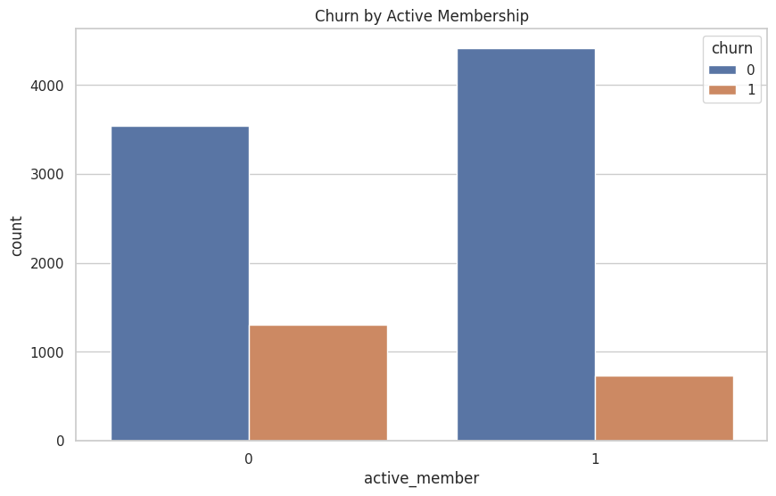
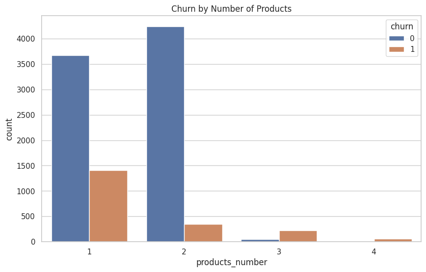

# analise-de-churn-de-clientes-bancarios
This project analyzes customer churn behavior in a banking dataset to identify patterns associated with customer attrition. The analysis focuses on demographic, financial, and behavioral variables that may influence churn.
---

## 📌 Project Overview

Understand which customer characteristics are more frequently associated with churn and generate business insights that could support retention strategies.


### Import data

```
import pandas as pd
import numpy as np
import matplotlib.pyplot as plt
import seaborn as sns
sns.set(style="whitegrid")
plt.rcParams["figure.figsize"] = (10, 6)


df = pd.read_csv("bank_churn.csv")
df.head()
```

### Cancelled percentage

```
churn_rate = df["churn"].mean()
print(f"Churn rate: {churn_rate:.2%}")

sns.countplot(x="churn", data=df)
plt.title("Customer Churn Distribution")
plt.xlabel("Churn")
plt.ylabel("Count")
plt.show()

sns.boxplot(x="churn", y="age", data=df)
plt.title("Age Distribution by Churn Status")
plt.show()


```

Churn rate: 20.37%


<table>
  <tr>
    <td align="center">
      <a href="#" title="Age">
        <br>
      </a>
    </td>
  </tr>
</table>


### Continue using the service

```
sns.countplot(x="active_member", hue="churn", data=df)
plt.title("Churn by Active Membership")
plt.show()

```
0-> Continue using
1-> Cancelled

<table>
  <tr>
    <td align="center">
      <a href="#" title="Age">
        <br>
      </a>
    </td>
  </tr>
</table>


```
sns.countplot(x="products_number", hue="churn", data=df)
plt.title("Churn by Number of Products")
plt.show()

```
<table>
  <tr>
    <td align="center">
      <a href="#" title="Age">
        <br>
      </a>
    </td>
  </tr>
</table>

---

## Tools Used
- Python
- Pandas
- Matplotlib
- Seaborn
- Google Colab


## Dataset Columns
- customer_id
- credit_score
- country
- gender
- age
- tenure
- balance
- products_number
- credit_card
- active_member
- estimated_salary
- churn

## Key Insights
- Churn is concentrated in specific customer segments.
- Customer activity level appears strongly related to retention.
- Age, country, and number of products may influence churn patterns.
- Balance and credit profile can provide additional retention signals.


## Business Conclusion
The analysis suggests that churn is likely influenced by a combination of demographic profile, engagement level, and product relationship. Customers with lower engagement and specific account characteristics may deserve greater retention attention. These findings could support more targeted retention strategies in banking environments.


---

## 🤝 Author

<table>
  <tr>
    <td align="center">
      <a href="https://www.linkedin.com/in/thalesfreirefarias/" target="_blank">
        <br>
        <sub><b>Thales Farias</b></sub>
      </a>
    </td>
  </tr>
</table>


12. Score de crédito por churn
python


sns.boxplot(x="churn", y="credit_score", data=df_analysis)
plt.title("Credit Score by Churn Status")
plt.show()
13. Saldo por churn
python


sns.boxplot(x="churn", y="balance", data=df_analysis)
plt.title("Balance by Churn Status")
plt.show()
14. Tempo de relacionamento por churn
python


sns.boxplot(x="churn", y="tenure", data=df_analysis)
plt.title("Tenure by Churn Status")
plt.show()
15. Cartão de crédito por churn
python


sns.countplot(x="credit_card", hue="churn", data=df_analysis)
plt.title("Churn by Credit Card Ownership")
plt.show()
16. Salário estimado por churn
python


sns.boxplot(x="churn", y="estimated_salary", data=df_analysis)
plt.title("Estimated Salary by Churn Status")
plt.show()
Insights em tabela resumida
No notebook, depois dos gráficos, você pode montar algo assim:

python


churn_by_country = df_analysis.groupby("country")["churn"].mean().sort_values(ascending=False)
print(churn_by_country)
churn_by_active = df_analysis.groupby("active_member")["churn"].mean()
print(churn_by_active)
churn_by_products = df_analysis.groupby("products_number")["churn"].mean()
print(churn_by_products)
Isso ajuda a sair do visual e mostrar também análise numérica.


