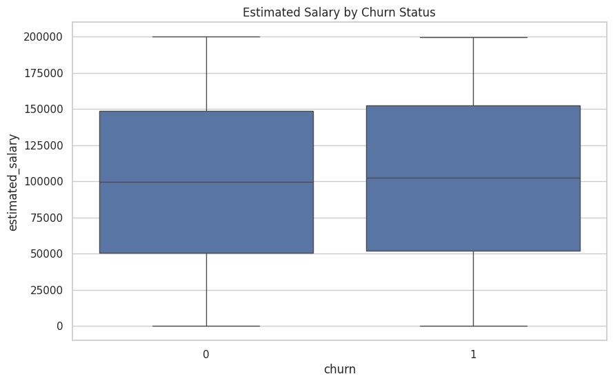

# Customer Churn Analysis in Banking

This project analyzes customer churn behavior in a banking dataset to identify patterns associated with customer attrition. The analysis focuses on demographic, financial, and behavioral variables that may influence churn.

## Project Overview

The goal of this project is to understand which customer characteristics are more frequently associated with churn and to generate business insights that can support retention strategies.

---


### Load Dataset

```
import pandas as pd
import numpy as np
import matplotlib.pyplot as plt
import seaborn as sns
sns.set(style="whitegrid")
plt.rcParams["figure.figsize"] = (10, 6)


df = pd.read_csv("bank_churn.csv")
df.head()
```

### Churn rate

```
churn_rate = df["churn"].mean()
print(f"Churn rate: {churn_rate:.2%}")

sns.countplot(x="churn", data=df)
plt.title("Customer Churn Distribution")
plt.xlabel("Churn")
plt.ylabel("Count")
plt.show()

sns.boxplot(x="churn", y="age", data=df)
plt.title("Age Distribution by Churn Status")
plt.show()


```

The overall churn rate is 20.37%, indicating that approximately one out of every five customers in the dataset left the bank.
0-> Continue using
1-> Cancelled


<table>
  <tr>
    <td align="center">
      <a href="#" title="Age">
        <br>
      </a>
    </td>
  </tr>
</table>


### Continue using the service

```
sns.countplot(x="active_member", hue="churn", data=df)
plt.title("Churn by Active Membership")
plt.show()

```


This chart suggests that inactive customers are more likely to churn than active customers.


Where:

0 = inactive customer
1 = active customer

<table>
  <tr>
    <td align="center">
      <a href="#" title="Age">
        <br>
      </a>
    </td>
  </tr>
</table>


```
sns.countplot(x="products_number", hue="churn", data=df)
plt.title("Churn by Number of Products")
plt.show()


```
This visualization shows how churn behavior changes according to the number of products used by each customer, helping identify segments with higher attrition risk.

<table>
  <tr>
    <td align="center">
      <a href="#" title="Age">
        <br>
      </a>
    </td>
  </tr>
</table>

### Estimated Salary by Churn Status

```
sns.boxplot(x="churn", y="estimated_salary", data=df)
plt.title("Estimated Salary by Churn Status")
plt.show()

```
<table>
  <tr>
    <td align="center">
      <a href="#" title="Age">
        <br>
      </a>
    </td>
  </tr>
</table>
---

### Churn by country

```
churn_by_country = df.groupby("country")["churn"].mean().sort_values(ascending=False)
print(churn_by_country)
```
The country-level analysis shows that **Germany** has the highest churn rate among the three countries in the dataset, followed by **Spain** and **France**

## Additional Numerical Analysis

To complement the visual analysis, churn rates were also calculated for key customer segments.

```
churn_by_country = df.groupby("country")["churn"].mean().sort_values(ascending=False)
print(churn_by_country)

churn_by_active = df.groupby("active_member")["churn"].mean().sort_values(ascending=False)
print(churn_by_active)

churn_by_products = df.groupby("products_number")["churn"].mean().sort_values(ascending=False)
print(churn_by_products)
```


## Tools and Technologies
- Python
- Pandas
- Matplotlib
- Seaborn
- Google Colab
- NumPy

## Dataset Features

- **customer_id**: unique customer identifier
- **credit_score**: customer's credit score
- **country**: customer's country of residence
- **gender**: customer's gender
- **age**: customer's age
- **tenure**: number of years as a customer
- **balance**: account balance
- **products_number**: number of bank products used
- **credit_card**: whether the customer has a credit card
- **active_member**: whether the customer is an active member
- **estimated_salary**: estimated annual salary
- **churn**: whether the customer left the bank

## Key Insights

- The overall churn rate is **20.37%**.
- Older customers show a higher tendency to churn.
- Inactive customers are significantly more likely to leave the bank.
- Churn rates vary across countries, with **Germany** showing the highest rate in this dataset.
- The number of products is also associated with churn behavior, suggesting differences in customer engagement.


## Business Conclusion

The analysis suggests that customer churn is influenced by a combination of demographic characteristics, engagement level, and product relationship. Inactive customers, older clients, and specific country segments appear to be more vulnerable to attrition. These findings can help support more targeted retention strategies in the banking sector.


---

## 🤝 Author

<table>
  <tr>
    <td align="center">
      <a href="https://www.linkedin.com/in/thalesfreirefarias/" target="_blank">
        <br>
        <sub><b>Thales Farias</b></sub>
      </a>
    </td>
  </tr>
</table>
