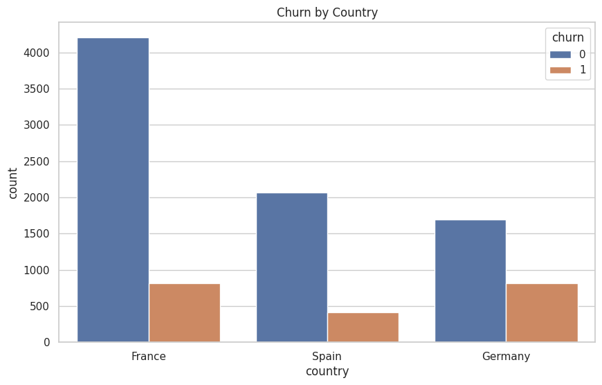

# analise-de-churn-de-clientes-bancarios
Analisar o comportamento de churn de clientes bancários para identificar padrões relacionados à saída de clientes da base e gerar insights que possam apoiar ações de retenção.

---

## 📌 Project Overview

Python project focused on ** Rent Analysis**

### Avarage Rent value by accomodation type

```
dados.groupby('Tipo').mean(numeric_only=True).round(2)

Get just numeric values to calculate mean

media = round(dados.groupby('Tipo')['Valor'].mean(),2).sort_values(ascending=True)
print(media)

Get especific values on Type Accomodation.
```

### Bar visualization

```
df_preco_tipo = dados.groupby('Tipo')[['Valor']].mean().sort_values('Valor')

df_preco_tipo.plot(kind='barh', figsize=(14, 10), color ='purple');
```
<table>
  <tr>
    <td align="center">
      <a href="#" title="Age">
        <br>
      </a>
    </td>
  </tr>
</table>
---


## Rent

This Python project presents :
Revenue by Brand
Revenue and Sales Quantity by Month
Revenue by Continent


```
Codes:
AnoMes = FORMAT('Planilha1'[Data da Venda], "YYYY-MM")

AnoMesOrdenacao = 
YEAR('Planilha1'[Data da Venda]) * 100 +
MONTH('Planilha1'[Data da Venda])

Mes = FORMAT('Planilha1'[Data da Venda], "MMM")
MesNum = MONTH('Planilha1'[Data da Venda])
```

---

###Filter Information

```
Code :
selecao = (df['Quartos'] >= 2) & (df['Valor'] < 3000) & (df['Area'] > 70)
df[selecao]

dados_selecao = pd.read_csv(url, usecols=['Id', 'Year_Birth', 'Income'])
dados_selecao.sort_values(by='Year_Birth', ascending=True).head(5)

```

###New Columns

```
dados['Descricao'] = dados['Tipo'] + ' em ' + dados['Bairro'] + ' com ' + \
                                        dados['Quartos'].astype(str) + ' quarto(s) ' + \
                                        ' e ' + dados['Vagas'].astype(str) + ' vaga(s) de garagem.'
dados.head()

dados['Possui_suite'] = dados['Suites'].apply(lambda x: "Sim" if x > 0 else "Não")
dados

dados['Valor_por_ano'] = dados['Valor_por_mes'] * 12 + dados['IPTU']
dados.head()
```


---

## 🛠️ Technologies Used

* Python as Pandas
* Google Colab
* Matplotlib
* Seaborn
* GitHub


---

## 🤝 Author

<table>
  <tr>
    <td align="center">
      <a href="https://www.linkedin.com/in/thalesfreirefarias/" target="_blank">
        <br>
        <sub><b>Thales Farias</b></sub>
      </a>
    </td>
  </tr>
</table>

